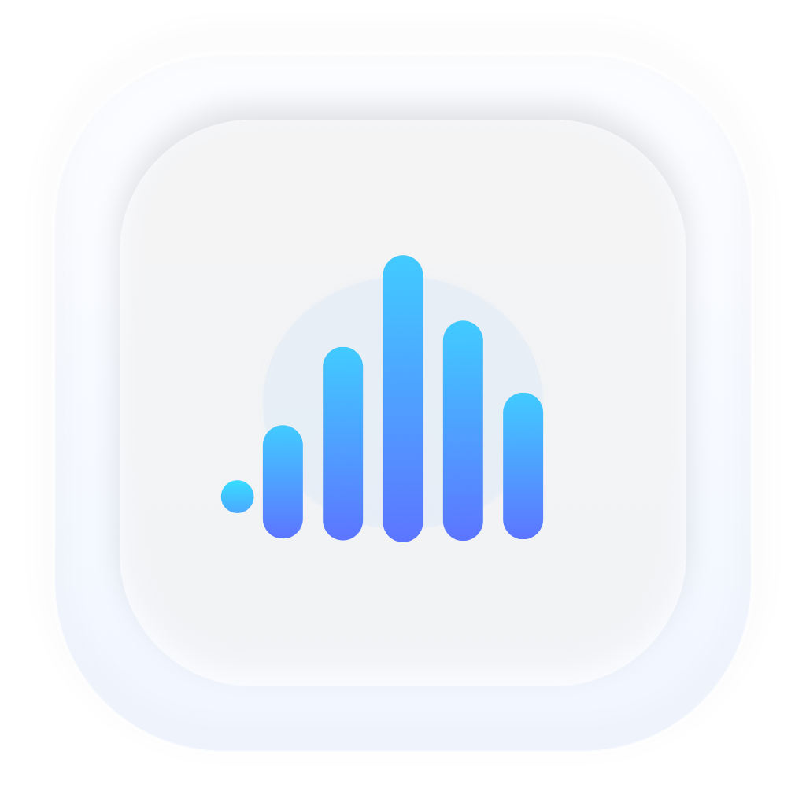

# QuotaBar

<p align="center">
  
</p>

<p align="center">
  <strong>macOS 菜单栏 AI 额度监控工具</strong><br>
  <em>一眼掌握 Copilot / Claude / Codex / Gemini 的实时用量</em>
</p>

<p align="center">
  <a href="https://github.com/nickthorpe71/QuotaBar/releases/latest"></a>
  <a href="https://github.com/nickthorpe71/QuotaBar/blob/main/LICENSE"></a>
  
  
</p>

---

[English](#english) | [中文](#中文)

---

## English

### What is QuotaBar?

QuotaBar is a lightweight macOS menu bar application that monitors your AI service quota usage in real time. It supports **GitHub Copilot**, **Claude (Anthropic)**, **Codex (OpenAI)**, and **Google Gemini** — all in one compact panel.

If you use multiple AI coding assistants and want to track how much quota you have left at a glance, QuotaBar is for you.

### Features

| Feature | Description |
|---------|-------------|
| **Multi-provider monitoring** | Track Copilot, Claude, Codex, and Gemini quotas simultaneously |
| **OAuth authentication** | Secure login via official OAuth flows — no API keys needed |
| **Multi-account support** | Add multiple accounts per provider, switch between them freely |
| **Real-time quota display** | Color-coded progress bars with remaining percentage and reset times |
| **Multiple quota windows** | Shows 5-hour limits, weekly limits, monthly limits, session limits, etc. |
| **Compact menu bar UI** | Native macOS design using system materials and vibrancy |
| **Drag & reorder** | Rearrange provider sections by dragging |
| **Collapsible sections** | Hide/show individual providers to keep the panel tidy |
| **CLI credential sync** | Automatically syncs active accounts to `gh` CLI and Gemini CLI |
| **Panel configuration** | Optional management panel integration for auth-file-based workflows |
| **Connection code transfer** | Share configurations between machines via connection codes |
| **Offline screenshot** | Capture quota state as an image for sharing |

### Supported Providers & Authentication

| Provider | Auth Method | What's Monitored |
|----------|-------------|-----------------|
| **GitHub Copilot** | GitHub Device Code Flow | 5-hour limit, weekly limit, code review limits |
| **Claude** | OAuth 2.0 + PKCE (Anthropic) | Session usage, plan tier |
| **Codex** | OAuth 2.0 + PKCE (OpenAI) | Rate limits, code review limits, plan type |
| **Gemini** | OAuth 2.0 (Google) | Flash/Pro/Lite model quotas, Code Assist tier |

### Installation

#### Download Release

1. Go to [Releases](https://github.com/nickthorpe71/QuotaBar/releases/latest)
2. Download `QuotaBar.zip`
3. Unzip and drag `QuotaBar.app` to your Applications folder
4. Open QuotaBar — it will appear in your menu bar

#### Homebrew

```bash
brew install --cask quotabar
```

#### Build from Source

Requires **macOS 14+** and **Swift 6.0+** (Xcode 16+).

```bash
git clone https://github.com/nickthorpe71/QuotaBar.git
cd QuotaBar
swift build -c release
# Binary at .build/release/QuotaBar
```

### Usage

1. **Launch QuotaBar** — a small icon appears in your menu bar
2. **Click the icon** — the quota panel opens showing all configured providers
3. **Add accounts** — click the ⚙️ gear icon to open Settings, then add accounts per provider
4. **Authenticate** — follow the OAuth flow in your browser
5. **Monitor** — quotas refresh automatically and show remaining percentage with color-coded bars

#### Color Indicators

| Color | Meaning |
|-------|---------|
| 🟢 Blue/Green | Healthy — plenty of quota remaining |
| 🟡 Yellow/Orange | Warning — quota getting low |
| 🔴 Red | Critical — quota nearly exhausted or exceeded |

#### Keyboard Shortcuts

- **Click** menu bar icon: Toggle panel
- **⌘Q**: Quit QuotaBar

### Configuration

#### OAuth Accounts (Recommended)

Go to **Settings → Accounts** and click "Add Account" for each provider. QuotaBar uses official OAuth flows:

- **Copilot**: Opens GitHub device code page — enter the code shown
- **Claude**: Opens Anthropic authorization page in browser
- **Codex**: Opens OpenAI authorization page in browser
- **Gemini**: Opens Google authorization page in browser

#### Management Panel (Optional)

For advanced users who run their own auth-file management panel:

1. Go to **Settings → Configuration**
2. Enter your panel URL and management key
3. QuotaBar will fetch quota through your panel's API proxy

### Requirements

- macOS 14.0 (Sonoma) or later
- Apple Silicon or Intel Mac

### Building & Testing

```bash
# Build
swift build

# Run tests (111 tests)
swift test

# Build release
swift build -c release
```

### Privacy & Security

- **No data collection** — all data stays on your Mac
- **Tokens stored locally** in `~/Library/Application Support/QuotaBar/` with 0600 permissions
- **No third-party servers** — communicates only with official provider APIs
- **OAuth flows** — uses official client IDs from each provider's CLI tools
- **Open source** — audit the code yourself

### License

[MIT License](LICENSE)

---

## 中文

### QuotaBar 是什么？

QuotaBar 是一款轻量级 macOS 菜单栏应用，用于实时监控你的 AI 服务额度用量。支持 **GitHub Copilot**、**Claude (Anthropic)**、**Codex (OpenAI)** 和 **Google Gemini** — 所有额度一目了然。

如果你同时使用多个 AI 编程助手，想随时了解剩余额度，QuotaBar 就是你需要的工具。

### 功能特性

| 功能 | 说明 |
|------|------|
| **多服务商监控** | 同时追踪 Copilot、Claude、Codex、Gemini 额度 |
| **OAuth 认证** | 通过官方 OAuth 流程安全登录，无需手动输入 API 密钥 |
| **多账号支持** | 每个服务商可添加多个账号，自由切换 |
| **实时额度显示** | 彩色进度条显示剩余百分比和重置时间 |
| **多维度额度窗口** | 显示 5 小时限额、周限额、月限额、会话限额等 |
| **紧凑菜单栏 UI** | 原生 macOS 设计，使用系统材质和半透明效果 |
| **拖拽排序** | 拖动调整服务商显示顺序 |
| **可折叠分区** | 隐藏/显示各个服务商，保持面板整洁 |
| **CLI 凭据同步** | 自动将当前账号同步到 `gh` CLI 和 Gemini CLI |
| **面板配置** | 可选的管理面板集成，支持 auth-file 工作流 |
| **连接码传输** | 通过连接码在不同机器间共享配置 |
| **离线截图** | 将额度状态导出为图片，便于分享 |

### 支持的服务商与认证方式

| 服务商 | 认证方式 | 监控内容 |
|--------|----------|----------|
| **GitHub Copilot** | GitHub 设备码流程 | 5 小时限额、周限额、代码审查限额 |
| **Claude** | OAuth 2.0 + PKCE (Anthropic) | 会话用量、订阅套餐 |
| **Codex** | OAuth 2.0 + PKCE (OpenAI) | 速率限制、代码审查限额、套餐类型 |
| **Gemini** | OAuth 2.0 (Google) | Flash/Pro/Lite 模型额度、Code Assist 等级 |

### 安装方式

#### 下载安装包

1. 前往 [Releases 页面](https://github.com/nickthorpe71/QuotaBar/releases/latest)
2. 下载 `QuotaBar.zip`
3. 解压后将 `QuotaBar.app` 拖入"应用程序"文件夹
4. 打开 QuotaBar — 菜单栏会出现图标

#### Homebrew 安装

```bash
brew install --cask quotabar
```

#### 从源码构建

需要 **macOS 14+** 和 **Swift 6.0+**（Xcode 16+）。

```bash
git clone https://github.com/nickthorpe71/QuotaBar.git
cd QuotaBar
swift build -c release
# 可执行文件位于 .build/release/QuotaBar
```

### 使用方法

1. **启动 QuotaBar** — 菜单栏出现一个小图标
2. **点击图标** — 打开额度面板，显示所有已配置的服务商
3. **添加账号** — 点击 ⚙️ 齿轮图标打开设置，为每个服务商添加账号
4. **完成认证** — 在浏览器中完成 OAuth 授权流程
5. **开始监控** — 额度自动刷新，彩色进度条显示剩余情况

#### 颜色指示

| 颜色 | 含义 |
|------|------|
| 🟢 蓝/绿色 | 正常 — 剩余额度充足 |
| 🟡 黄/橙色 | 警告 — 额度偏低 |
| 🔴 红色 | 危险 — 额度即将用尽或已超限 |

### 配置说明

#### OAuth 账号（推荐）

进入 **设置 → 账号管理**，点击"添加账号"：

- **Copilot**：打开 GitHub 设备码页面 — 输入显示的验证码
- **Claude**：在浏览器中打开 Anthropic 授权页面
- **Codex**：在浏览器中打开 OpenAI 授权页面
- **Gemini**：在浏览器中打开 Google 授权页面

#### 管理面板（可选）

适用于运行自建 auth-file 管理面板的高级用户：

1. 进入 **设置 → 配置**
2. 输入面板地址和 management key
3. QuotaBar 将通过面板的 API 代理获取额度

### 系统要求

- macOS 14.0（Sonoma）或更高版本
- Apple Silicon 或 Intel Mac

### 构建与测试

```bash
# 构建
swift build

# 运行测试（111 个测试）
swift test

# 构建发布版
swift build -c release
```

### 隐私与安全

- **不收集任何数据** — 所有数据保留在本机
- **令牌本地存储** 于 `~/Library/Application Support/QuotaBar/`，权限 0600
- **不依赖第三方服务器** — 仅与各服务商官方 API 通信
- **OAuth 流程** — 使用各服务商 CLI 工具的官方 Client ID
- **完全开源** — 欢迎审计代码

### 许可证

[MIT License](LICENSE)

---

### Contributing

Contributions are welcome! Please open an issue or pull request.

### Acknowledgments

QuotaBar uses official OAuth client IDs from:
- [GitHub Copilot](https://github.com/features/copilot)
- [Anthropic Claude](https://claude.ai)
- [OpenAI Codex](https://openai.com)
- [Google Gemini](https://gemini.google.com)
